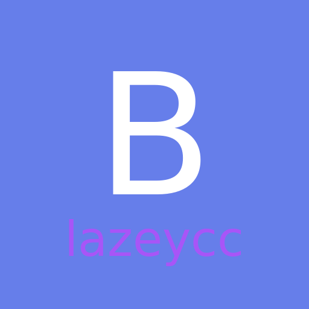

<p align="center">
  <picture>
    <source media="(prefers-color-scheme: dark)" srcset="https://raw.githubusercontent.com/blazeycc/Blazeycc/main/build/icon-light.png">
    <source media="(prefers-color-scheme: light)" srcset="https://raw.githubusercontent.com/blazeycc/Blazeycc/main/build/icon.png">
    
  </picture>
</p>
<p align="center">
  <strong>Record any website as video</strong><br>
  Capture demos, tutorials, and presentations as high-quality MP4, WebM, or GIF
</p>

<p align="center">
  <a href="https://github.com/blazeycc/Blazeycc/releases/latest"></a>
  <a href="https://github.com/blazeycc/Blazeycc/releases"></a>
  <a href="LICENSE"></a>
  
</p>

---

## 📥 Download

<table>
<tr>
<td align="center"><b>Windows</b></td>
<td align="center"><b>Linux</b></td>
</tr>
<tr>
<td align="center">
<a href="https://github.com/blazeycc/Blazeycc/releases/latest/download/Blazeycc-Setup.exe">Installer (.exe)</a><br>
<a href="https://github.com/blazeycc/Blazeycc/releases/latest/download/Blazeycc-Portable.exe">Portable</a>
</td>
<td align="center">
<a href="https://github.com/blazeycc/Blazeycc/releases/latest/download/Blazeycc.AppImage">AppImage</a><br>
<a href="https://github.com/blazeycc/Blazeycc/releases/latest/download/Blazeycc.deb">.deb</a> · <a href="https://github.com/blazeycc/Blazeycc/releases/latest/download/Blazeycc.rpm">.rpm</a>
</td>
</tr>
</table>

> **Note:** Linux users may need to run with `--no-sandbox` flag.

---

## ✨ Features

| Feature | Free |
|---------|:----:|
| Record any URL as video | ✅ |
| Export to MP4, WebM, GIF | ✅ |
| 23 social media presets | ✅ |
| Screenshot capture | ✅ |
| Bookmarks & history | ✅ |
| Auto-scroll recording | ✅ |
| Audio capture | ✅ |
| Dark & light themes | ✅ |
| No watermark | ✅ |
| 4K export (3840×2160) | ✅ |
| Custom watermarks | ✅ |
| Batch recording | ✅ |
| Scheduled recordings | ✅ |
| Annotations | ✅ |

---

## 🎯 Perfect For

- **Content Creators** — Capture website animations, demos, and tutorials
- **Social Media Managers** — Record in the perfect format for any platform
- **Educators** — Create web-based tutorials and walkthroughs
- **Product Teams** — Document features and create product demos
- **Developers** — Record bug reproductions and UI interactions

---

## 🚀 Quick Start

1. **Download** the app for your platform above
2. **Enter a URL** and click "Go"
3. **Click Record** to start capturing
4. **Export** as MP4, WebM, or GIF

### Platform Presets

Choose from 23 optimized presets for social media:

`YouTube` `Instagram Reels` `TikTok` `Twitter/X` `LinkedIn` `Facebook` `Snapchat` `Pinterest` `Discord` `Twitch` and more...

---

## 🛠️ Development

```bash
# Clone the repo
git clone https://github.com/blazeycc/Blazeycc.git
cd Blazeycc

# Install dependencies
npm install

# Run in development
npm start

# Build for your platform
npm run build:linux   # Linux (AppImage, deb, rpm)
npm run build:win     # Windows (exe, portable)
```

### Tech Stack

- **Electron 40** — Cross-platform desktop framework
- **FFmpeg** — Video encoding via ffmpeg-static
- **MediaRecorder API** — Webview capture

### Project Structure

```
├── main.js               # Electron main process
├── js/
│   ├── state.js          # Shared state, DOM elements, constants
│   ├── ui.js             # UI helpers, theme, zoom, panels
│   ├── recording.js      # Recording, canvas capture, audio, trim
│   ├── annotations.js    # Interactive annotation system
│   ├── ai.js             # Ollama config & AI metadata generation
│   ├── ai-features.js    # Smart chapters, clips, thumbnails
│   ├── features.js       # Batch, scheduled, watermark, fast encoding
│   └── app.js            # Main init & event wiring
├── index.html            # Main UI
├── preload.js            # IPC bridge
├── mobile/               # Capacitor mobile app (iOS/Android)
│   ├── src/              # Mobile HTML/CSS/JS
│   └── plugins/          # Custom native plugins
└── docs/                 # Marketing site (blazeycc.com)
```

---

## 📄 License

MIT License — see [LICENSE](LICENSE) for details.

---

<p align="center">
  Made with ❤️ by <a href="https://github.com/blazeycc">blazeycc</a>
</p>